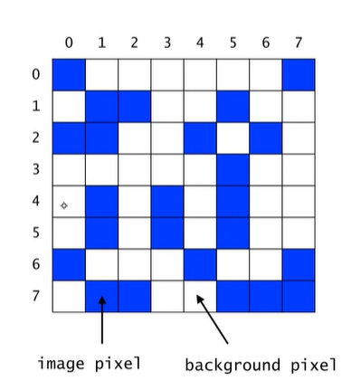
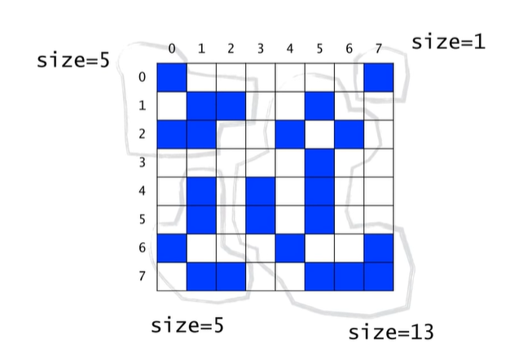
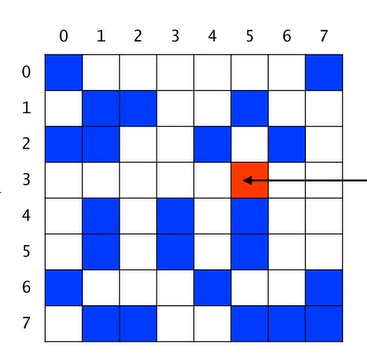
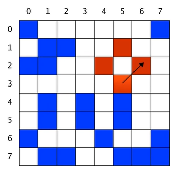
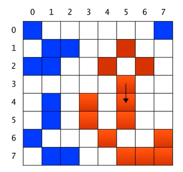

# Recursion의 응용 - Counting Cells in a Blob

> **영리한 프로그래밍을 위한 알고리즘 강좌** ([💻인프런](https://www.inflearn.com/course/%EC%95%8C%EA%B3%A0%EB%A6%AC%EC%A6%98-%EA%B0%95%EC%A2%8C)) - 부경대학교 IT융합응용공학과 권오흠 교수님
> 

## Counting Cells in a Blob

- 입력으로 하나의 Binary 이미지가 주어진다.
- 각 픽셀은 background pixel(흰색)이거나 혹은 image pixel(파란색)
- 서로 연결된 image pixel들의 집합을 blob이라고 부른다.
- 상하좌우 및 대각방향으로도 연결된 것으로 간주한다.



- 위의 그림은 아래와 같이 총 4개의 blob이 존재



### 특정 좌표가 속한 blob의 크기

- 입력
    - N * N 크기의 2차원 그리드(grid)
    - 하나의 좌표 (x, y)
- 출력
    - 픽셀 (x, y)가 포함된 blob의 크기
    - (x, y)가 어떤 blob에도 속하지 않는 경우에는 0

### Recursive Thinking

- 현재 픽셀이 속한 blob의 크기를 카운트하려면
    - 현재 픽셀이 image color가 아니라면
        - 0을 반환한다.
    - 현재 픽셀이 image color라면
        - 먼저 현재 픽셀을 카운트한다. (count = 1)
        - 현재 픽셀이 중복 카운트되는 것을 방지하기 위해 다른 색으로 칠한다.
        - 현재 픽셀에 이웃한 모든 픽셀들(8개 픽셀들)에 대해서
            - 그 픽셀이 속한 blob의 크기를 카운트하여 카운터에 더해준다.
        - 카운터를 반환한다.

### 순환적 알고리즘

- x = 5, y = 3이라고 가정, 즉 이 픽셀이 포함된 blob의 크기를 계산하는 것이 목적이다.
- **count = 0** 에서 시작
- 현재 cell을 다른 색으로 칠하고 count를 1 증가한다. 이렇게 색칠하는 것은 이 픽셀이 중복 count되는 것을 방지하기 위해서이다.
- 현재 **count = 1**



- (5, 3) 픽셀에 인접한 8개의 픽셀 각각에 대해서 순서대로 그 픽셀이 포함된 blob의 크기를 count한다. 북, 북동, 동, 동남, … 순서로 고려한다.
- 북쪽(5, 2) 픽셀이 포함된 blob의 크기는 0이다. 따라서 count 값은 변화 없다.
- 북동쪽(6, 2) 픽셀이 속한 blob을 count하고, count된 픽셀들을 색칠한다.
    - 북동쪽(6, 2) 픽셀이 속한 blob의 count는 (6, 2), (5, 1), (4, 2)로 3
    - 현재 **count = 1 + 3 = 4**
    - count된 모든 픽셀들은 빨간색으로 칠해서 중복카운트 방지



- 동쪽(6, 3)과 남동쪽(6, 4) 픽셀이 포함된 blob의 크기는 0이다.
- 남쪽(5, 4) 픽셀이 속한 blob의 크기는 9이다. 카운트하고 색칠한다.
    - 현재 **count = 4 + 9 = 13**



- 남서, 서, 북서 방향의 픽셀이 속한 blob은 없거나 혹은 이미 카운트되었다.
- 결과적으로 **count = 13**

### Algorithm for countCells(x, y)

```
if the pixel (x, y) is outside the grid
	the result is 0;
else if pixel (x, y) is not an image pixel or already counted
	the result is 0;
else
	set the color of the pixel (x, y) to a red color;
	the result is 1 plus the number of cells in each piece of the blob that includes a nearest neighbour;
```

### **Java로 구현**

```java
private static int BACKGROUND_COLOR = 0;
private static int IMAGE_COLOR = 1;
private static int ALREADY_COUNTED = 2;

public int countCells(int x, int y) {
	if(x < 0 || x >= N || y < 0 || y >= N)
		return 0;
	else if(grid[x][y] != IMAGE_COLOR)
		return 0;
	else {
		grid[x][y] = ALREADY_COUNTED;
		return 1 + countCells(x-1, y+1) + countCells(x, y+1)
			+ countCells(x+1, y+1) + countCells(x-1, y)
			+ countCells(x+1, y) + countCells(x-1, y-1)
			+ countCells(x, y-1) + countCells(x+1, y-1);
	}
}
```
